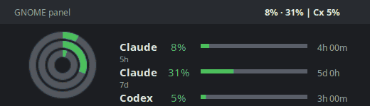

[](https://opensource.org/licenses/MIT)

# QuotaBar

> A local quota monitor for AI coding agents.

QuotaBar keeps the usage windows of your authenticated coding agents visible
without a browser tab. The actively maintained Linux tray app shows **Claude
Code** and **Codex CLI** side by side, with live reset countdowns and threshold
alerts. It uses your local CLI credentials directly; there is no backend service
or Python virtual environment.

| Platform | Current scope |
| --- | --- |
| **Linux** | Native AppIndicator tray app for Claude Code and Codex CLI |
| **Windows** | Original upstream taskbar monitor, retained in this repository |

**Repository:** [github.com/josefyu/QuotaBar](https://github.com/josefyu/QuotaBar)

## Linux — Claude Code and Codex CLI

The Linux implementation lives in [`linux/`](linux/) and is the recommended
QuotaBar experience.



This image is rendered by the monitor itself: [`linux/tools/render_demo.py`](linux/tools/render_demo.py) uses the same icon code as the tray, so it is not a desktop screenshot.

### What you get

- Separate, matching Claude (`C`) and Codex (`X`) tray indicators
- 5-hour and 7-day quota windows, reset countdowns, and warning notifications
- Manual refresh, configurable polling interval, and optional panel labels
- Automatic local-CLI refresh for expired credentials
- Headless terminal and JSON modes for scripts or SSH sessions

### Requirements

| Required | Optional |
| --- | --- |
| Linux desktop with an AppIndicator-compatible tray | Codex CLI, installed and signed in |
| Python 3 | Desktop notifications (`gir1.2-notify-0.7`) |
| Claude Code, installed and signed in | |

On Debian/Ubuntu, QuotaBar installs `python3-gi`, `python3-gi-cairo`,
`gir1.2-gtk-3.0`, and an Ayatana/AppIndicator binding during the one-command
setup below. Only packages that are actually missing are installed.

### Install and run

On a Debian/Ubuntu desktop, clone, setup and start are one command:

```bash
git clone https://github.com/josefyu/QuotaBar.git ~/QuotaBar && ~/QuotaBar/linux/install.sh --install-deps --start
```

If the repository is already on the machine, the setup alone is:

```bash
cd /path/to/QuotaBar && ./linux/install.sh --install-deps --start
```

Keep the clone where it is: the installer registers that directory on the
Python path, so moving or deleting it breaks the launcher.

`--install-deps` installs the required AppIndicator packages through `apt` and
may ask for your sudo password. `--start` launches the tray monitor immediately.
QuotaBar also creates an XDG autostart entry, so it starts automatically at your
next desktop login.

Later starts need only:

```bash
claude-usage-monitor &
```

To check credentials and usage before starting the tray:

```bash
claude-usage-monitor --once
```

The launcher is installed at `~/.local/bin/claude-usage-monitor`. Settings live
in `~/.config/claude-usage-monitor/config.json` (or the equivalent under
`XDG_CONFIG_HOME`).

### Tray icons

Claude and Codex use separate, visually identical tray indicators. Each has two concentric usage rings:

- Outer ring: 5-hour window
- Inner ring: 7-day window
- Centre glyph: `C` for Claude or `X` for Codex

The Codex indicator is shown only when the Codex CLI is signed in. Without Codex credentials, only the two-ring Claude indicator is shown.

Ring colors follow the configured usage thresholds: green below 50%, yellow from 50%, orange from the warning threshold, and red from the critical threshold. If no Claude usage data can be read, the tray shows an error icon.

### Panel labels

The optional text labels next to the icons use this format:

```text
Cl 42% · 68%    Cx 17% · 31%
```

Each pair is the respective 5-hour and 7-day usage. The labels can be disabled from the tray menu entry `Text im Panel`.

### Tray menu

Each Linux tray indicator has its own menu, which shows:

- Its own `5h` and `7d` rows with reset countdowns
- Timestamp of the last successful fetch
- `Jetzt aktualisieren`
- `Aktualisierungsintervall`
- `Text im Panel`
- `Benachrichtigungen`
- `Beenden`

Menu labels are German.

### Terminal modes

The Linux monitor can also run without the tray:

```bash
claude-usage-monitor --once
claude-usage-monitor --once --json
claude-usage-monitor --watch --interval 300
```

### Privacy and data handling

The Linux monitor reads local credentials from `~/.claude/.credentials.json` and, when present, `$CODEX_HOME/auth.json` or `~/.codex/auth.json`.

Network access is limited to Anthropic's Claude usage lookup (including its
Messages API fallback) and ChatGPT's Codex usage endpoint. There is no update
check, telemetry, or backend service in the Linux implementation.

Expired tokens are refreshed by invoking the respective local CLI. The monitor does not write credential files itself.

The only local monitor state is `~/.config/claude-usage-monitor/config.json`, which stores the polling interval, panel-label toggle, and notification toggle. It does not store window position, language, or update-check timestamps.

### How it works

The Linux monitor reads local credentials, queries the provider usage endpoints, renders the tray icon as a PNG in `XDG_RUNTIME_DIR`, and passes that icon to AppIndicator.

Polling runs in a background thread at the configured interval, and the poller wakes early when credential files change or when `Jetzt aktualisieren` is selected.

### Regenerating the demo

```bash
python3 linux/tools/render_demo.py
```

## Attribution

The Windows implementation was originally created by [Craig Constable / CodeZeno](https://github.com/CodeZeno/Claude-Code-Usage-Monitor). This project retains the original MIT license and copyright notice.

The Linux implementation in [`linux/`](linux/) is an independent Linux desktop
adaptation, maintained in [josefyu/QuotaBar](https://github.com/josefyu/QuotaBar)
by [josefyu](https://github.com/josefyu).

## Windows

The Windows app began as [CodeZeno/Claude-Code-Usage-Monitor](https://github.com/CodeZeno/Claude-Code-Usage-Monitor) and keeps its architecture, dashboard, and Theme Studio. This fork tracks upstream and adds its own tray presentation: each provider icon stacks the 5-hour value over the 7-day one, and the tooltip and taskbar widget give the wall-clock reset time rather than a countdown.

Builds are published from this repository's [Releases](https://github.com/josefyu/QuotaBar/releases). The WinGet package `CodeZeno.ClaudeCodeUsageMonitor` remains upstream's and installs their build, not this one.

A lightweight, open-source Windows taskbar widget for monitoring Claude Code usage limits and reset times. It can also display usage for Codex, Google Antigravity, OpenCode Go, and Cursor.


## Features

- Displays current usage and time remaining until each limit resets
- Counts usage up from zero or down from the full allowance, whichever you prefer
- Supports Claude Code, Codex, Google Antigravity, OpenCode Go, and Cursor
- Lives in the Windows taskbar with quick controls in the system tray
- Supports multiple monitors and Windows startup
- Includes configurable refresh intervals, providers, languages, and updates
- Provides built-in themes and a visual Theme Studio for custom layouts
- Collects no analytics or telemetry

### Requirements

- Windows 10 or Windows 11
- At least one supported provider installed and signed in

Claude Code credentials can be detected from the CLI, Claude desktop app, or WSL. Other providers are optional and can be enabled independently from the dashboard.

## Installation

Download `claude-code-usage-monitor.exe` from the [latest release](https://github.com/josefyu/QuotaBar/releases/latest) and run it. It is a single portable executable with no installer and no runtime to add; settings, themes, and the usage cache live in `%APPDATA%\ClaudeCodeUsageMonitor`. Enabling startup also adds one `Run` entry under `HKCU\Software\Microsoft\Windows\CurrentVersion\Run`. To remove it, disable startup from the tray menu, close the app, and delete the file and that folder.

From PowerShell:

```powershell
$dir = "$env:LOCALAPPDATA\Programs\QuotaBar"
New-Item -ItemType Directory -Force $dir | Out-Null
Invoke-WebRequest `
  "https://github.com/josefyu/QuotaBar/releases/latest/download/claude-code-usage-monitor.exe" `
  -OutFile "$dir\claude-code-usage-monitor.exe"
& "$dir\claude-code-usage-monitor.exe"
```

The release carries a `.sha256` file next to the executable if you want to verify the download. The build is unsigned, so SmartScreen shows a warning on first run — "More info" then "Run anyway" gets past it.

To start it with Windows, enable startup from the tray icon's right-click menu, which registers whatever path you ran it from.

Upstream's WinGet package installs their build rather than this fork's:

```powershell
winget install CodeZeno.ClaudeCodeUsageMonitor
```

## Usage

Start the monitor:

```powershell
claude-code-usage-monitor
```

Open the settings dashboard directly:

```powershell
claude-code-usage-monitor --dashboard
```

Use the dashboard to select providers, change the refresh interval, choose a display, enable startup, or customize the widget. **Settings > Display > Usage direction** switches the default theme and other themes that support this setting between showing what has been used and what is left, with Used as the default. Selecting Remaining makes a fresh limit read 100% and drain as you work.

Theme authors can opt in with `.display` bindings, including `{claude.session.display:usage_line}` and `{claude.session.display:usage_badge}`. Existing `.percentage`, `.remaining`, and unsuffixed usage summaries keep their meaning; warning thresholds should continue to use `.percentage`.

In the default theme, left-click a provider tray icon to show or hide the widget and right-click it to open the menu.

## Provider setup

| Provider | Setup |
| --- | --- |
| Claude Code | Sign in with the Claude Code CLI or desktop app. Windows and WSL credentials are detected automatically. |
| Codex | Install and sign in to the Codex CLI, then enable Codex in **Providers**. |
| Google Antigravity | Sign in to Antigravity, then enable it in **Providers**. |
| OpenCode Go | Connect an OpenCode Go account, configure the credentials described below, then enable OpenCode in **Providers**. |
| Cursor | Sign in to Cursor, then enable it in **Providers**. The local session is detected automatically. |

For OpenCode Go, set `OPENCODE_GO_WORKSPACE_ID` and `OPENCODE_GO_AUTH_COOKIE`, or create `%APPDATA%\opencode-go\config.json`:

```json
{
  "workspaceId": "wrk_01...",
  "authCookie": "your-opencode-auth-cookie"
}
```

The workspace ID is part of the OpenCode Go workspace URL. The auth cookie comes from an authenticated `opencode.ai` browser session. Set `OPENCODE_GO_CONFIG_FILE` to use a different config path.

For Cursor, `CURSOR_SESSION_TOKEN` can override the automatically detected local session.

## Data and privacy

The monitor reads local sign-in credentials for enabled providers and sends usage requests directly to their official services. It has no backend service, collects no telemetry, and does not upload credentials or project files.

Credentials are read without modifying the provider files that contain them. OpenCode Go credentials saved in a JSON configuration file are plain text and should be protected like a browser session cookie.

## Troubleshooting

Run diagnostics with:

```powershell
claude-code-usage-monitor --diagnose
```

The diagnostic log is written to `%TEMP%\claude-code-usage-monitor.log`. Application settings are stored in `%APPDATA%\ClaudeCodeUsageMonitor\settings.json`.

## Build from source

Install [Rust](https://www.rust-lang.org/tools/install) 1.95 or later, then run:

```powershell
cargo build --release
```

The executable will be created at `target\release\claude-code-usage-monitor.exe`.

## Account Support

QuotaBar works only with accounts that can sign in to the corresponding local
CLI and whose provider exposes usage data through its authenticated endpoint.
Provider plans, limits, and endpoint behaviour can change; QuotaBar does not
add account eligibility beyond Claude Code or Codex CLI themselves.

## Open Source

QuotaBar is licensed under [MIT](LICENSE).

If you want to inspect the behavior or audit the code, everything is in this repository.
